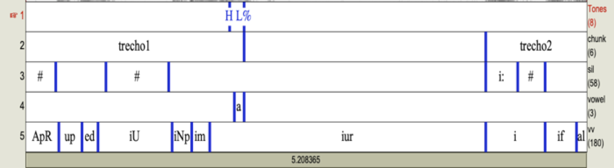

## Manual of the Praat Script
# Prosody Descriptor Extractor
### by Plinio A. Barbosa (2014, 2020)
### Version: May 2020

This manual gives a general overview of how the _Prosody Descriptor Extractor Praat_ script works. Any questions can be asked directly to this email: pabarbosa.unicampbr@gmail.com. The script is documented directly thoroughly in each main section of the script file. You can have some info of what each part does by just scrolling down in the script text itself.

** PART A – HOW THE SCRIPTS WORKS**

### Main operations:

1. The script starts with the input parameters form, the window that is presented after clicking on Run. The window is presented with the default values for the input parameters. The script, the reference file \*.TableOfReal which accompanies the script kit and all coupled Audio/TG files should be in the same folder.
For each parameter you may keep the value as it is informed (default) or writing another one if you want to modify the current value. They are:

    1. **Output file names**. OutPutProsParameters, OutPutSil, OutPutEff and OutPutTones (in the script they correspond to the variables FileOutPar,  FileOutSil , FileOutEff  and FileOutTones respectively). Inform the complete name (with the extension TXT) of the output file, at your choice. Only OutPutProsParameters file will be generated in any case and from computations made in the labelled intervals of the obligatory chunk tier.  OutPutSil file is written only if you have a Pause Tier; OutPutEff file is written only if you have a Vowel Tier and  OutPutTones file is written only if you have a Tones Tier (see section B).

    1. **Audio files extension** (AudiofileExtension variable). Inform the extension of the audio files to be analized preceded by “*.”

    1. **Optional tiers presence**. Inform, by checking the corresponding options, which are the optional tiers present in your TG file (variables HasTonesTier, HasVVTier, HasVowelTier, HasSilTier).

    1. **F0 unit**. Inform, by checking (in semitones) or unchecking (Hertz) option InSemitones, which unit for F0 computation is desired. Semitones are computed using 1 Hz as reference.

    1. **Tiers' positions** (tonesTier, vVTier, vowelTier, silTier and chunkTier variables). Inform the positions where the respective tiers are in your TG file.

    1. **Pitch cut-offs** (left_F0Threshold and right_F0Threshold variables). The default values (75 and 300 Hz) are for male speakers. This is the range where the Praat F0 tracker will search for F0 values. For very expressive speech you’ll probably have to use a higher upper value. For females you should change this to the range 120 to 500 Hz. If you know the F0 range of your data, inform the limits around 10% less for the lower limit and around 10 % more for the upper limit. If you have both female and male speakers, use from 75 and 600 Hz.

    1. **Reference language** (Reference variable). Indicates the TableOfReal file corresponding to the language whose reference values for phone duration (mean and standard-deviation) need to be used to normalize raw syllable-sized duration. It is an accompany file for the script (BP.TableOfReal for Brazilian Portuguese. Please, ask the authors for tables for other languages).

1. The script continues by recovering the names of all wav files in the current folder. Then the algorithm runs for each audio file in the folder. Each paired-by-name TG file is also read.

1. The script computes obligatorily all parameters listed in item 5 for each chunk of the chunk tier. 

1. Durations of VV units are normalized and smoothed according to segmentation in the VV tier, if any. In this phase, three output text files are produced with (a)  the sequence of VV duration z-scores for each audio file as audiofilenamedur.txt, (b) stress group duration and number of VVs in each stress group as audiofilenameSG.txt and (c) a modified TextGrid file including an interval tier with the stress group intervals and a point tier with smoothed z-scores peak values  at the end of the stress group, obtained from the SG Detector algorithm (Barbosa, 2006, 2007) as audiofilenameEnriched.TextGrid. All VV units should be segmented and labelled according to ASCII symbols in TabelaIPAMarcacaoSGDetector.pdf, attached to the script kit. The two most common errors are: (1) error of labelling (in that case the script gives an error informing the wrong label and where in time its is located), (b) let a blank interval in any place from the first to the last VV (in that case the script gives an 'empty formula' error).

1. The parameters computed by the script from the chunk tier are (variable name in italics): 
        a. F0 median in semitones re 1 Hz/Hertz assigned to the variable f0med in the output file,
        b. F0 standard-deviation in semitones/Hertz assigned to the variable f0sd in the output file),
        c. F0 semi-amplitude between quartiles in semitones/Hertz assigned to the variable fSAQ in the output file),
        d. F0 minimum in semitones re 1 Hz/Hertz assigned to the variable f0min in the output file,
        e. F0 maximum in semitones re 1 Hz/Hertz for the whole chunk assigned to the variable f0max in the output file,
        f. Standard-deviation of F0 maxima in semitones/Hertz assigned to the variable sdf0peak in the output file,
        g. Mean peakness of F0 max in semitones re 1 Hz/Hertz relatively F0 range and multiplied by 1000 assigned to the variable f0peakwidth  in the output file,
        h. Smoothed F0 peak rate in peaks per second assigned to the variable f0peak_rate in the output file,
        i. Standard-deviation of the F0 maxima positions, in seconds, assigned to the variable sdtf0peak in the output file,
        j. 1st-derivative F0 mean in Hertz/frame of the positive derivatives assigned to the variable df0posmean in the output file,
        k. 1st-derivative F0 mean in Hertz/frame of the negative derivatives assigned to the variable df0negmean in the output file,
        l. 1st-derivative F0 standard-deviation in Hertz/frame of the positive derivatives assigned to the variable df0sdpos in the output file,
        m. 1st-derivative F0 standard-deviation in Hertz/frame of the negative derivatives assigned to the variable df0sdneg in the output file,
        n. Spectral emphasis in dB assigned to the variable emph in the output file, 
        o. Intensity variation coefficient assigned to the variable cvint (standard deviation of global intensity divided by global intensity mean) in the output file,
        p. LTAS slope between bands 0-1000 Hz and 1000/4000 Hz assigned to the variable slLTASmed in the output file, 
        q. LTAS slope between bands 0-1000 Hz and 4000/8000 Hz assigned to the variable slLTAShigh in the output file, 
        r. HNR (Harmonic-to-Noise ratio) in dB assigned to the variable hnr in the output file, 
        s. SPI (Soft Phonation Index) in dB assigned to the variable SPI in the output file. It is the average ratio of low frequency harmonic energy in the band 70–1600 Hz to the higher frequency harmonic energy in the band 1600–4500 Hz for the voiced areas of the analyzed signal. The higher the value the less adducted are the vocal folds during vibration,
        t. Local shimmer in percentual values assigned to the variable shimmer in the output file,
        u. Local jitter in percentual values assigned to the variable jitter in the output file,
        v. Speech rate in VV units per second assigned to the variable srate in the output file IF there is a VV tier,
        w. Articulation rate in VV units per second assigned to the variable artrate in the output file IF there is a VV tier and a Sil Tier.

1. The parameters computed by the script from the tones tier are (variable name in italics): 
        a. Tone types along the tier, as labelled by the user, assigned to the variable tonetype in the tones output file,
        b. Time where the tone is in the audio file in seconds, assigned to the variable time in the tones output file,
        c. Relative alignment from to VV unit onset divided by the VV duration, assigned to the variable alignVV in the tones output file,
        d. Mean F0 of the VV unit where the tone is, assigned to the variable meanf0VV in the tones output file,

1. The parameters computed by the script from the sil tier are (variable name in italics): 
        a. Pause type in the intervals, as labelled by the user, assigned to the variable type in the sil output file,
        b. IPI, the duration from the onset of the previous pause to the onset of the current pause interval, assigned to the variable IPI in the sil output file,
        c. Pause duration, the duration of the pause interval, assigned to the variable durSIL in the sil output file.

1. The parameters computed by the script from the vowel tier are (variable name in italics): 
        a. Vowel segment, the label of the vowel of each interval, assigned to the variable vowel in the vowel output file,
        b. H1- H2, the value in dB of the difference between harmonics H1 and H2 in the central part of the vowel interval, assigned to the variable H1H2 in the vowel output file,
        c. CPP, the value in dB of the Cepstral Prominence Peak in the central part of the vowel interval, assigned to the variable CPP in the vowel output file.
        d. dur, duration of the vowel
        e. F0 median in the vowel in Hz
        f. F0 standard-deviation in the vowel in Hz
        g. F0 baseline in the vowel in Hz

1. The  VV tier is used to generate the files designated in item 4 above.

Observations:

For F0 smoothing we use a cut-off frequency for the smoothing filter of 5 Hz. This is used to compute F0 main peaks throughout the utterances. Tests can be done beforehand with the utterances to evaluate if this is the best solution for the language. If a different cut-off frequency needs to be used, change it by rewriting the value at the beginning of the script. (variable *smthf0Thr*).

The temporal step in seconds for computing the F0 first derivative step (*F0step variable* ) is 0.05. 

The frequency  threshold for computing spectral emphasis variable *(spectralemphasisthreshold* variable) was fixed at  400 Hz.

**PART B – HOW ANNOTATION SHOULD BE DONE**

Annotation should be done with Praat TextGrids with a mandatory chunk tier containing the intervals within which to compute the prosodic parameters described above for its tier. The symbols for the phonetic segments in the VV Tier must coincide with those indicated in the language-specific TableOfReal file. Adaptations can be done under request to P. Barbosa. The rest is done automatically by the script.
The figure below illustrates all tiers. Their names appear in the right part of the panel. We can see that, in the Sil Tier, there are silent pauses (#) and a filled pause (i:). When segmenting these pauses, it is important to make sure that the temporal limits of the corresponding chunk tier includes all its pause intervals of the Sil Tier. In the vowel tier there is only an interval with vowel /a/, but it can have much more, any vowel from which to extract H1-H2 and CPP values. The VV Tier is the usual VV tier used for normalizing duration in the SG detector script (2006): it is the sequences of all V-V intervals of the audio file with no blank intervals in between. Labels should be in accordance with the symbols in the attached TableIPA-SGDetectorSimbols.pdf file. The Chunk Tier indicates with two labels the intervals within which the prosodic parameters in item 5 above will be computed (in the example here, trecho1 and trecho2). The Tones Tier has only two tones here and it is a point tier.

